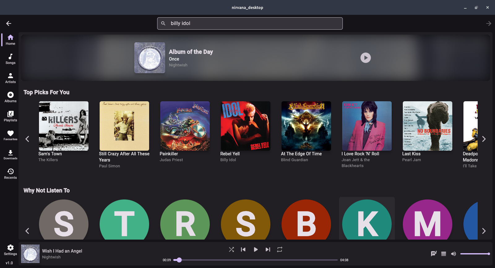
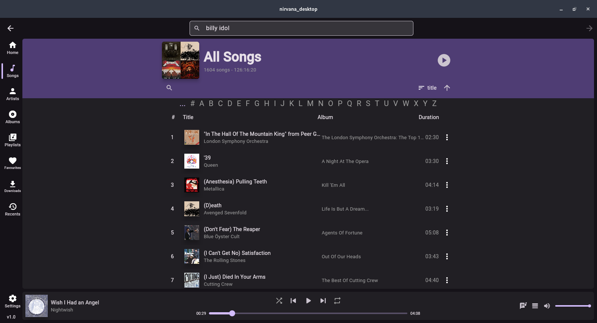
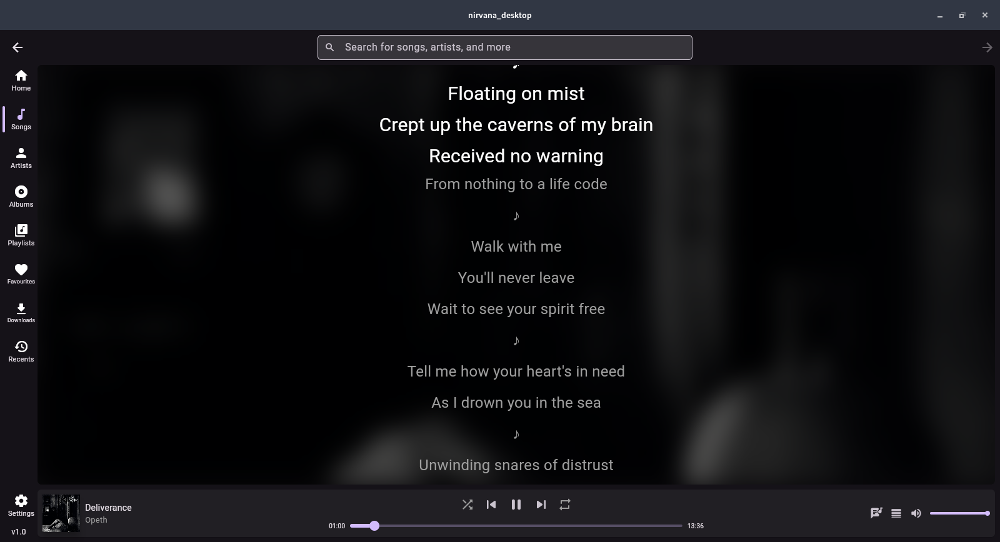

# Nirvana Music App

## Overview

**Nirvana** is a personal music streaming app built with **Flutter (frontend)** and **FastAPI (backend)**. It supports playlist management, local music play, song caching, and search via YouTube Music API. This project was built to showcase full-stack development skills, API integration, and app architecture.

## Tech Stack

**Frontend:** Flutter, Riverpod, just_audio, Go router \
**Backend:** FastAPI, SQLite3, yt_dlp, ytmusicapi, mutagen \
**Language:** Python, Dart


## Features

* load songs from local files
* Search for songs using `ytmusicapi`
* Play songs with `just_audio`
* Create and manage playlists
* Save songs locally (SQLite)
* Beautiful Flutter UI
* FastAPI backend with REST endpoints

## Project Structure
```
nirvana-music-app/
├── backend
│   ├── app
│   │   ├── db.py
│   │   ├── __init__.py
│   │   ├── main.py
│   │   ├── models.py
│   │   ├── __pycache__
│   │   └── utils.py
│   └── requirements.txt
├── frontend
│   └── lib
│       ├── layout
│       │   └── app_shell.dart
│       ├── main.dart
│       ├── models
│       │   └── models.dart
│       ├── pages
│       │   ├── album_content.dart
│       │   ├── all_albums_content.dart
│       │   ├── all_artists_content.dart
│       │   ├── all_playlists_content.dart
│       │   ├── artist_content.dart
│       │   ├── custom_cards.dart
│       │   ├── home_content.dart
│       │   ├── library_content.dart
│       │   ├── lyrics_content.dart
│       │   ├── playlist_content.dart
│       │   ├── recent_content.dart
│       │   ├── search_content.dart
│       │   └── settings_content.dart
│       ├── providers
│       │   ├── audio_provider.dart
│       │   ├── audio_provider.g.dart
│       │   ├── audio_state.dart
│       │   ├── audio_state.freezed.dart
│       │   ├── lyrics_controller.dart
│       │   ├── providers.dart
│       │   ├── search_provider.dart
│       │   ├── search_provider.freezed.dart
│       │   └── search_provider.g.dart
│       └── services
│           ├── api_service.dart
│           ├── history_service.dart
│           ├── local_folders_notifier.dart
│           └── theme_notifier.dart
└── README.md

```

## Architecture

```scss
FastAPI (Backend)
    ↓
REST API (JSON)
    ↓
ApiService (Flutter)
    ↓
Riverpod Providers (State Management)
    ↓
UI Widgets & Screens
```

## Setup Instructions

### Backend:

```bash
cd backend
python -m venv venv
source venv/bin/activate
pip install -r requirements.txt
uvicorn app.main:app --reload
```

### Frontend:

```bash
cd frontend
flutter pub get
flutter run
```

```
BASE_URL=http://127.0.0.1:8000
```
> **Note:** Ensure `BASE_URL` in `api_service.dart` points to your backend instance.

### Development Notes

- Some YouTube links may fail if signature extraction breaks (yt_dlp issue).
- To auto-update yt_dlp, you can run:
```bash
pip install -U yt-dlp
```

## Screenshots








## Future Improvements

* Support for Spotify/Deezer APIs to support better song search.
* Mood-based or AI-generated playlists
* Playback analytics dashboard
* AI DJ / Recommendation engine


## Author

**Arop Kuol** \
[aropk03@gmail.com](mailto:aropk03@gmail.com) \
[LinkedIn Profile](www.linkedin.com/in/ak-kuol-53438631a)

## License

MIT License \
Copyright (c) 2025 Arop Kuol


